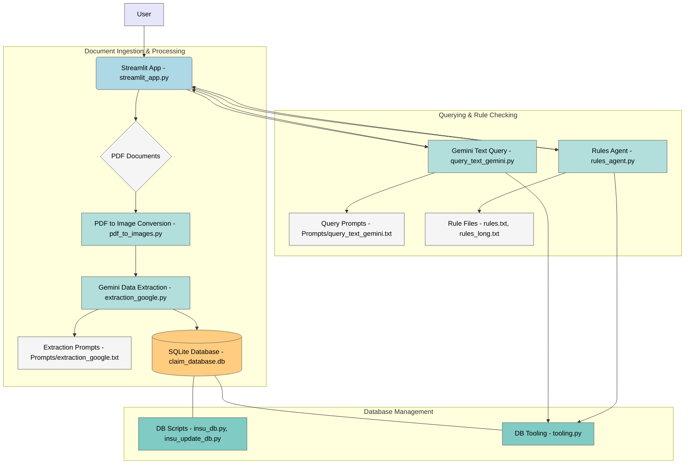

```mermaid
graph TD;
    A[User] --> B(Streamlit App - streamlit_app.py);

    subgraph "Document Ingestion & Processing"
        direction LR
        B --> C{PDF Documents};
        C --> D[PDF to Image Conversion - pdf_to_images.py];
        D --> F[Gemini Data Extraction - extraction_google.py];
        F --> G[Extraction Prompts - Prompts/extraction_google.txt];
        F --> H[(SQLite Database - claim_database.db)];
    end

    subgraph "Database Management"
        direction TB
        H --- I[DB Scripts - insu_db.py, insu_update_db.py];
        H --- J[DB Tooling - tooling.py];
    end

    subgraph "Querying & Rule Checking"
        direction LR
        B --> K[Gemini Text Query - query_text_gemini.py];
        K --> L[Query Prompts - Prompts/query_text_gemini.txt];
        K --> J;
        K --> B;

        B --> M[Rules Agent - rules_agent.py];
        M --> N[Rule Files - rules.txt, rules_long.txt];
        M --> J;
        M --> B;
    end

    %% Professional Styling
    style A fill:#e6e6fa,stroke:#666,stroke-width:1px,color:#000
    style B fill:#add8e6,stroke:#666,stroke-width:1px,color:#000
    style C fill:#f5f5f5,stroke:#666,stroke-width:1px,color:#000
    style D fill:#b2dfdb,stroke:#666,stroke-width:1px,color:#000
    style F fill:#b2dfdb,stroke:#666,stroke-width:1px,color:#000
    style G fill:#f5f5f5,stroke:#666,stroke-width:1px,color:#000
    style H fill:#ffcc80,stroke:#666,stroke-width:1px,color:#000
    style I fill:#80cbc4,stroke:#666,stroke-width:1px,color:#000
    style J fill:#80cbc4,stroke:#666,stroke-width:1px,color:#000
    style K fill:#b2dfdb,stroke:#666,stroke-width:1px,color:#000
    style L fill:#f5f5f5,stroke:#666,stroke-width:1px,color:#000
    style M fill:#b2dfdb,stroke:#666,stroke-width:1px,color:#000
    style N fill:#f5f5f5,stroke:#666,stroke-width:1px,color:#000
```